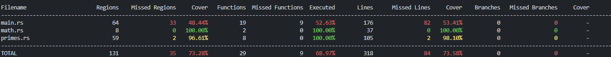

## Testing

### Test Coverage

Testing was mainly focused to math and prime portion of the game - common functions such as file-saving/loading and input handling was not tested.

Testing was performed with representative inputs, such as:
- large primes
- large non-primes, including non-prime with only primes as factor
- encryptable content that was both within and outside of the accepted ranges

Tests can be repeated with the instructions in the main Readme.
